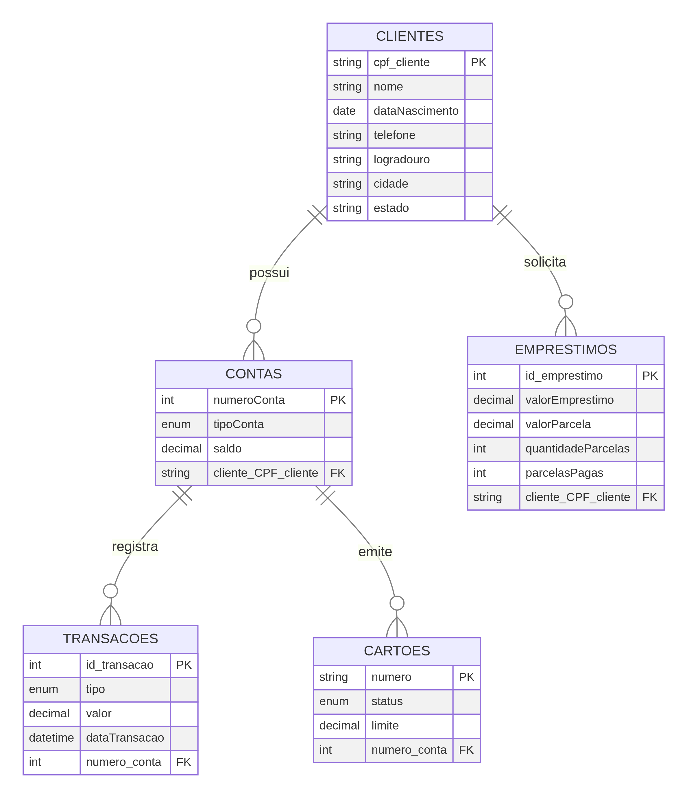

# 🏦 Modelagem de Sistema Bancário em SQL

Este repositório contém o projeto de modelagem de um banco de dados para um **Sistema Bancário**, desenvolvido como parte dos meus estudos em SQL. O projeto abrange desde a criação da estrutura das tabelas até a implementação de visualizações (Views) para análise de dados.

---

## 📊 Estrutura do Banco de Dados

Abaixo está a representação visual do modelo de dados (ERD) utilizado no projeto:



### 📋 Entidades Principais

| Tabela | Descrição |
| :--- | :--- |
| **Clientes** | Armazena informações pessoais e de contato dos correntistas. |
| **Contas** | Registra os diferentes tipos de contas (Corrente, Poupança, Empresarial). |
| **Transações** | Histórico de movimentações financeiras (Saques, Depósitos, Transferências). |
| **Cartões** | Gerenciamento de cartões vinculados às contas, incluindo limites e status. |
| **Empréstimos** | Controle de crédito solicitado pelos clientes e acompanhamento de parcelas. |

---

## 🚀 Funcionalidades Implementadas

O projeto inclui scripts SQL para:
1.  **Criação de Tabelas**: Estrutura robusta com chaves primárias, estrangeiras e restrições (Constraints).
2.  **Inserção de Dados**: Massa de dados realista para testes e simulações.
3.  **Views de Análise**:
    *   `clientes_contas`: Visão consolidada de clientes e seus saldos.
    *   `clientes_sudeste`: Filtro geográfico para estratégias regionais.
    *   `ClientesEmprestimosMaiorQue6000`: Identificação de clientes com alto volume de crédito.

---

## 🛠️ Como Utilizar

1.  Clone este repositório:
    ```bash
    git clone https://github.com/ErickRochaNascimento/Modelagem-SQL-Estudos.git
    ```
2.  Execute o script `sistema_bancario.sql` em seu gerenciador de banco de dados (MySQL, MariaDB, etc.).
3.  Explore as Views criadas para extrair insights.

---

## 🧑‍💻 Autor

**Erick Rocha Nascimento**  
🔗 [LinkedIn](https://www.linkedin.com/in/erickrochanascimento) | [GitHub](https://github.com/ErickRochaNascimento)
